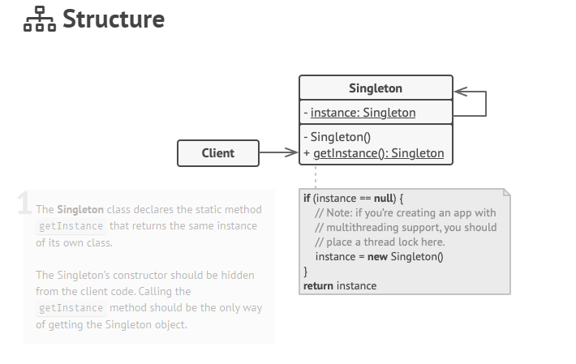

# Singleton

## Intent (Amaç)

- Singleton, kendi türünde yalnızca bir nesnenin var olmasını sağlayan ve diğer tüm kodlar için ona tek bir erişim noktası sağlayan yaratıcı bir tasarım modelidir.


## Sorun 
Singleton modeli, Tek Sorumluluk İlkesini ihlal ederek aynı anda iki sorunu çözer:

### 1 - Tek bir nesnenin oluşturulmasını sağlar.

>Bir sınıfın yalnızca tek bir örneğe sahip olduğundan emin olun. 

>Neden birisi bir sınıfın kaç örneği olduğunu kontrol etmek istesin ki?

>Bunun en yaygın nedeni, bir veritabanı veya dosya gibi bazı paylaşılan kaynaklara erişimi kontrol etmektir. 

>Şöyle çalışır: Bir nesne yarattığınızı, ancak bir süre sonra yeni bir nesne yaratmaya karar verdiğinizi hayal edin. Yeni bir nesne almak yerine, daha önce oluşturduğunuz nesneyi alırsınız. 

>Bir kurucu çağrısının tasarım gereği her zaman yeni bir nesne döndürmesi gerektiğinden, bu davranışın normal bir kurucu ile uygulanmasının imkansız olduğunu unutmayın.

### 2 - Nesneye tek bir erişim noktası sağlar.

> Bu örneğe küresel bir erişim noktası sağlayın. Sizin (tamam, benim) bazı temel nesneleri depolamak için kullandığınız global değişkenleri hatırlıyor musunuz? Çok kullanışlı olmalarına rağmen, herhangi bir kod potansiyel olarak bu değişkenlerin içeriğinin üzerine yazabileceğinden ve uygulamayı çökertebileceğinden çok güvensizdirler.

>Tıpkı global bir değişken gibi, Singleton modeli de programdaki herhangi bir yerden bazı nesnelere erişmenizi sağlar. Ancak, bu örneğin başka bir kod tarafından üzerine yazılmasını da önler. 

>Bu sorunun başka bir yönü daha var: 1. sorunu çözen kodun programınızın her yerine dağılmasını istemezsiniz. Özellikle kodunuzun geri kalanı buna bağlıysa, tek bir sınıf içinde olması çok daha iyidir.

Günümüzde Singleton modeli o kadar popüler hale geldi ki, listelenen sorunlardan yalnızca birini çözse bile insanlar bir şeye singleton diyebilir.

## Çözüm 

Singleton'ın tüm uygulamalarında şu iki ortak adım vardır: 

- Diğer nesnelerin Singleton sınıfıyla new işlecini kullanmasını önlemek için varsayılan oluşturucuyu özel yapın. 
- Yapıcı görevi gören statik bir oluşturma yöntemi oluşturun. Başlık altında, bu yöntem bir nesne oluşturmak için özel kurucuyu çağırır ve onu statik bir alana kaydeder. Bu yönteme yapılan sonraki tüm çağrılar, önbelleğe alınmış nesneyi döndürür. 

Kodunuzun Singleton sınıfına erişimi varsa Singleton'ın statik yöntemini çağırabilir. Bu nedenle, bu yöntem her çağrıldığında, her zaman aynı nesne döndürülür.

## Gerçek Dünya Analojisi 

The government, Singleton modelinin mükemmel bir örneğidir. Bir ülkenin yalnızca bir resmi governmentı olabilir. Governmentları oluşturan bireylerin kişisel kimlikleri ne olursa olsun, "X governmentı" başlığı, sorumlu insan grubunu tanımlayan küresel bir erişim noktasıdır.



## Sözde kod 

Bu örnekte, veritabanı bağlantı sınıfı Singleton gibi davranır. Bu sınıfın ortak bir yapıcısı yoktur, bu nedenle nesnesini almanın tek yolu getInstance yöntemini çağırmaktır. Bu yöntem, ilk oluşturulan nesneyi önbelleğe alır ve onu sonraki tüm çağrılarda döndürür.

```java

// The Database class defines the `getInstance` method that lets
// clients access the same instance of a database connection
// throughout the program.
class Database is
    // The field for storing the singleton instance should be
    // declared static.
    private static field instance: Database

    // The singleton's constructor should always be private to
    // prevent direct construction calls with the `new`
    // operator.
    private constructor Database() is
        // Some initialization code, such as the actual
        // connection to a database server.
        // ...

    // The static method that controls access to the singleton
    // instance.
    public static method getInstance() is
        if (Database.instance == null) then
            acquireThreadLock() and then
                // Ensure that the instance hasn't yet been
                // initialized by another thread while this one
                // has been waiting for the lock's release.
                if (Database.instance == null) then
                    Database.instance = new Database()
        return Database.instance

    // Finally, any singleton should define some business logic
    // which can be executed on its instance.
    public method query(sql) is
        // For instance, all database queries of an app go
        // through this method. Therefore, you can place
        // throttling or caching logic here.
        // ...

class Application is
    method main() is
        Database foo = Database.getInstance()
        foo.query("SELECT ...")
        // ...
        Database bar = Database.getInstance()
        bar.query("SELECT ...")
        // The variable `bar` will contain the same object as
        // the variable `foo`.
```


